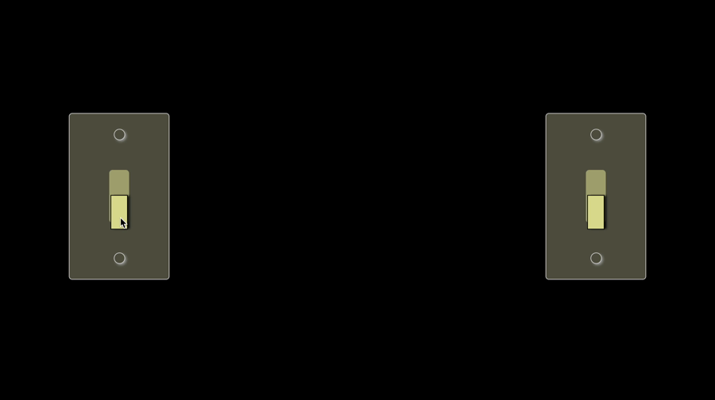

# Dual-light-switch-app-ReactJS
Coded two light switches that work in sync to both turn on or off no matter which one you choose.
Refractored code to include stateful components. Created a ```Switch``` component
to manage state.

### Screenshot




### Links

- Live Site URL: [CodeSandbox](https://codesandbox.io/s/l7-the-perfect-team-switch-component-ind41?file=/src/Switch.js)

### Built with

- Semantic HTML5 markup
- CSS 
- JavaScript 
- ES6
- JSX
- [React](https://reactjs.org/) - JS library
